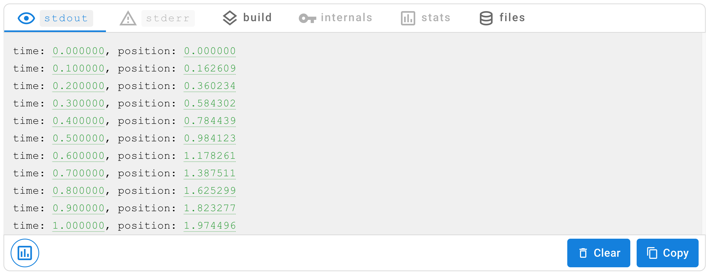
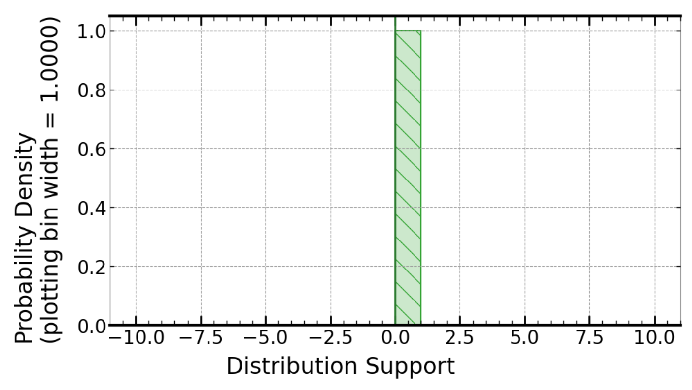
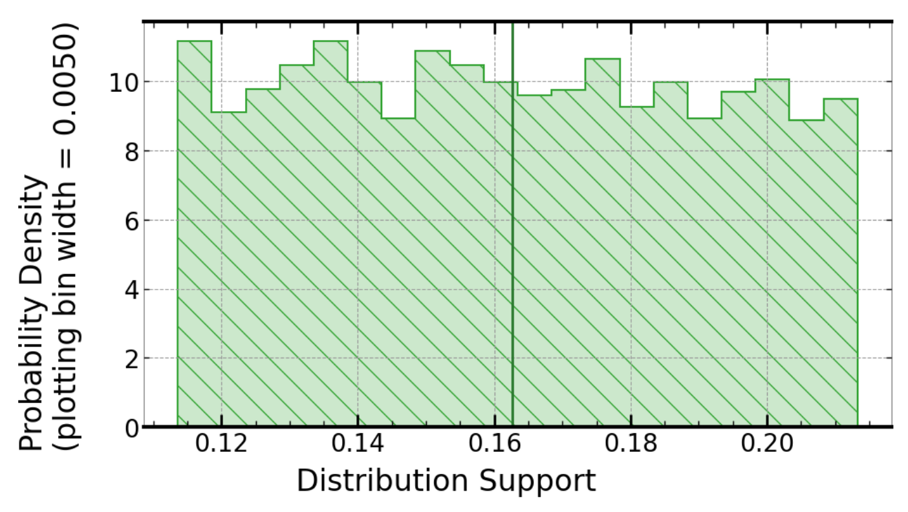
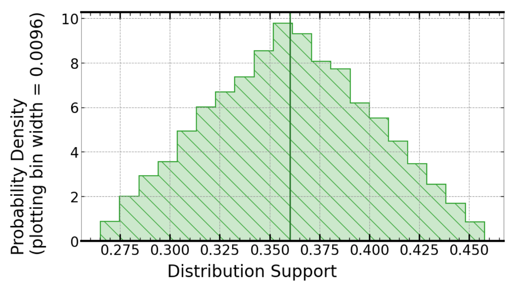
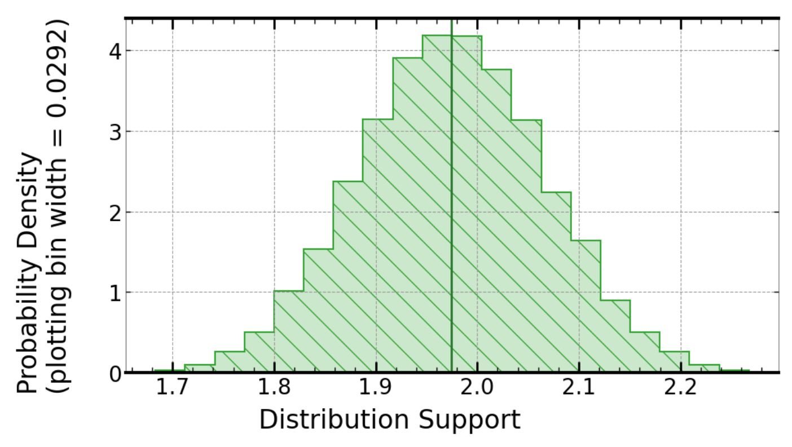

# Dead Reckoning in One Dimension

Dead reckoning is a simple method of estimating position by incorporating estimates of velocity with elapsed time. This technique is sensitive to cumulative errors, with position estimates deviating from the true position over time. Signaloid's uncertainty tracking processor technology allows for these cumulative errors to be quantified and tracked through a calculation, in order to quantify the uncertainty in the resulting position estimates.

This example provides a simple dead reckoning implementation in a single dimension. The program takes speed measurements as an input, modelling the measurement uncertainty associated with these speeds as uniformly distributed within the range specified by the measurement uncertainty. This uncertainty is then tracked through the calculations performed by the program to provide an estimate of uncertainty for each position estimate output after each timestep.

## Running the program
You can run the program by clicking on the "Add to signaloid.io" button at the top of the page. Then, on the signaloid.io page you can build and run this application.

The following command line arguments can optionally be used to modify the behaviour of the program:

- **[-s Path to speed inputs]** *(Default value: `speed.csv`)* 
    The path to a CSV file containing speed inputs for the program. For each speed measurement in the CSV file, the program evaluates a new position calculated from: `previous position + speed * measurement time period`.
- **[-u Measurement uncertainty for speed inputs]** *(Default value: `1.0`)* 
    The measurement uncertainty associated with the speeds provided in the input CSV file. In this example, measurement uncertainty is modelled with a uniform distribution.
- **[-t Time period between successive speed measurements]** *(Default value: `0.1`)* 
    The time period between one speed measurement and the next in the input CSV file.
- **[-h ]** 
    Help flag, displays program usage.

This repository contains some dummy speed data, in `inputs/speed.csv` as an example input to demonstrate the program.

## Output of the program
Running the program with the default options produces the following result:

Hovering over the position estimates will allow you to view the full uncertainty distribution for the estimate:

At time t = 0.0:

 

At time t = 0.1:

 

At time t = 0.2:

 

At time t = 1.0:

You can see that as time progresses, the uncertainty in the position estimate increases, and begins to resemble a Gaussian distribution.
